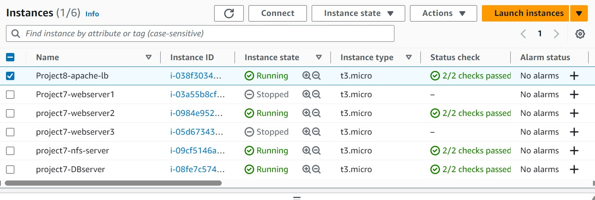
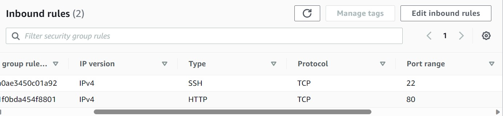
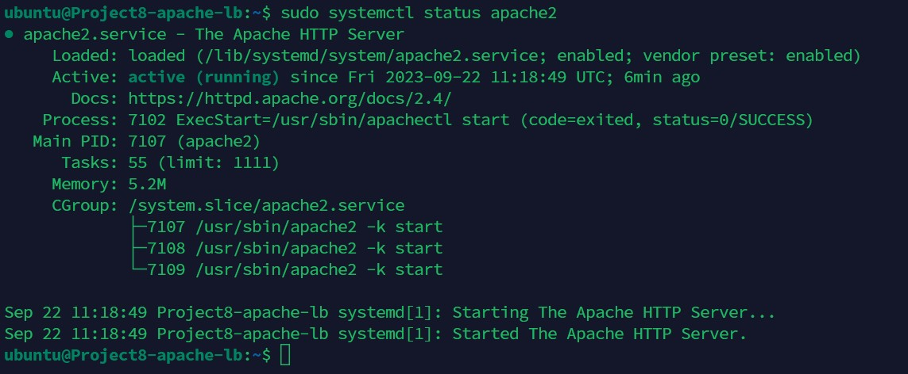

# Kingsley Documentation of Project 8

## Task - Deploy and configure an Apache Load Balancer for Tooling Website solution on a separate Ubuntu EC2 intance. Make sure that users can be served by Web servers through the Load Balancer.

### Prerequisites - Make sure that you have following servers installed and configured within Project-7:

1. Two RHEL8 Web Servers

2. One MySQL DB Server (based on Ubuntu 20.04)

3. One RHEL8 NFS server

## Steps - Configure Apache As A Load Balancer

1. Create an Ubuntu Server 20.04 EC2 instance and name it Project-8-apache-lb

2. Open TCP port 80 on Project8-apache-lb by creating an Inbound Rule in Security Group

3. Install Apache Load Balancer on Project8-apache-lb server and configure it to point traffic coming to LB to both Web Servers:

#Install apache2

`sudo apt update -y`

`sudo apt install apache2 -y`

`sudo apt-get install libxml2-dev -y`

#Enable following modules:

`sudo a2enmod rewrite`

`sudo a2enmod proxy`

`sudo a2enmod proxy_balancer`

`sudo a2enmod proxy_http`

`sudo a2enmod headers`

`sudo a2enmod lbmethod_bytraffic`

#Restart apache2 service

`sudo systemctl restart apache2`

#Make sure apache2 is up and running

`sudo systemctl status apache2`

