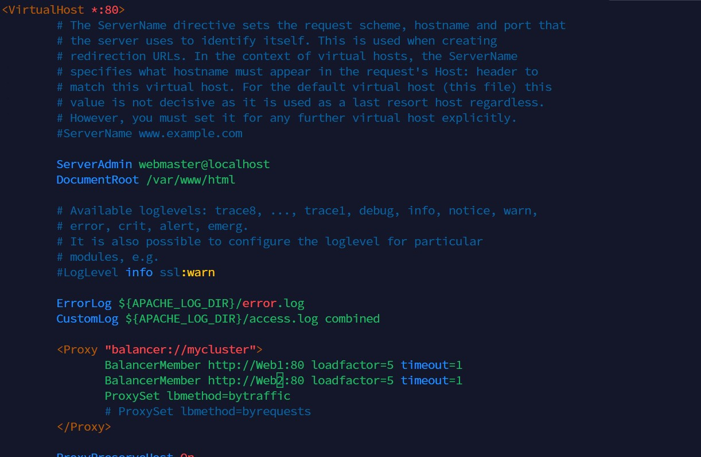

# Kingsley Documentation of Project 8

## Task - Deploy and configure an Apache Load Balancer for Tooling Website solution on a separate Ubuntu EC2 intance. Make sure that users can be served by Web servers through the Load Balancer.

### Prerequisites - Make sure that you have following servers installed and configured within Project-7:

1. Two RHEL8 Web Servers

2. One MySQL DB Server (based on Ubuntu 20.04)

3. One RHEL8 NFS server

## Steps - Configure Apache As A Load Balancer

1. Create an Ubuntu Server 20.04 EC2 instance and name it Project-8-apache-lb

2. Open TCP port 80 on Project8-apache-lb by creating an Inbound Rule in Security Group

3. Install Apache Load Balancer on Project8-apache-lb server and configure it to point traffic coming to LB to both Web Servers:

#Install apache2

`sudo apt update -y`

`sudo apt install apache2 -y`

`sudo apt-get install libxml2-dev -y`

#Enable following modules:

`sudo a2enmod rewrite`

`sudo a2enmod proxy`

`sudo a2enmod proxy_balancer`

`sudo a2enmod proxy_http`

`sudo a2enmod headers`

`sudo a2enmod lbmethod_bytraffic`

#Restart apache2 service

`sudo systemctl restart apache2`

#Make sure apache2 is up and running

`sudo systemctl status apache2`

#Configure load balancing

`sudo vi /etc/apache2/sites-available/000-default.conf`

`<Proxy "balancer://mycluster">
               BalancerMember http://<WebServer1-Private-IP-Address>:80 loadfactor=5 timeout=1
               BalancerMember http://<WebServer2-Private-IP-Address>:80 loadfactor=5 timeout=1
               ProxySet lbmethod=bytraffic
               # ProxySet lbmethod=byrequests
        </Proxy>

        ProxyPreserveHost On
        ProxyPass / balancer://mycluster/
        ProxyPassReverse / balancer://mycluster/`

#Restart apache server

`sudo systemctl restart apache2`

4. Verify that our configuration works – try to access your LB’s public IP address or Public DNS name from your browser:

`sudo systemctl restart apache2`

#Open two ssh/Putty consoles for both Web Servers and run following command:

`sudo tail -f /var/log/httpd/access_log`

## Optional Step – Configure Local DNS Names Resolution

*What we can do, is to configure local domain name resolution. The easiest way is to use /etc/hosts file, although this approach is not very scalable, but it is very easy to configure and shows the concept well. So let us configure IP address to domain name mapping for our LB*

#Open this file on the LB server

`sudo vi /etc/hosts`

#Add 2 records into this file with Local IP address and arbitrary name for both of your Web Servers

`WebServer1-Private-IP-Address` :Web1

`WebServer2-Private-IP-Address` :Web2

#Now you can update your LB config file with those names instead of IP addresses.

`sudo vi /etc/apache2/sites-available/000-default.conf`

#You can try to curl your Web Servers from LB locally curl http://Web1 or curl http://Web2 – it shall work.

`curl http://Web1`

`curl http://Web2`

*Remember, this is only internal configuration and it is also local to your LB server, these names will neither be ‘resolvable’ from other servers internally nor from the Internet.*

